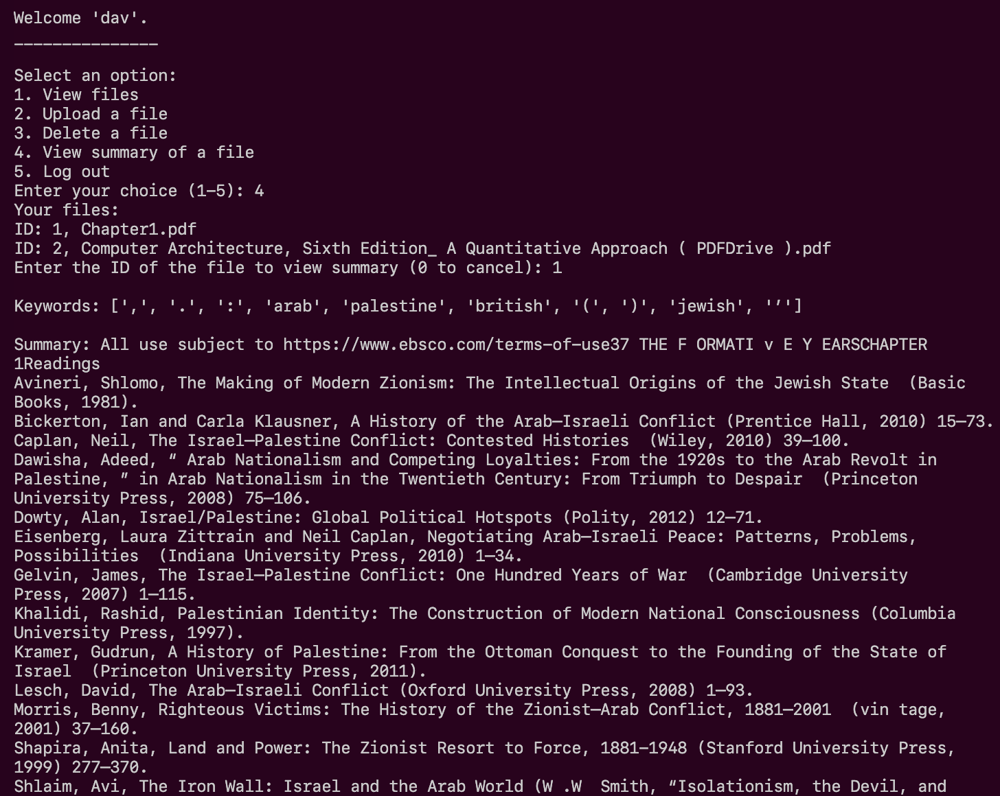

# Smart Document Analyzer

### EC530 Final Project
#### David Li

An easy to use command-line based program to store, view, manipulate, and summarize documents with secure user authentication and history backtracking.

## Features

- User registration and login functionality
- File upload and management
- Word count for uploaded files (.txt, .doc, .docx, .pdf)
- Logging of user actions and application events
- Database management and file deletion options
- Summarization of documents and additional links suggestions

## Requirements

- Python 3.x
- SQLite3
- PyPDF
- python-docx
- logging
- nltk


## Installation

1. Clone the repository
2. Run the application with ```python3.11 smart_doc.py``` or python3.x version of your choice
3. Once logged in, you can:
- View uploaded files
- Upload new files
- Delete files
- Summarize uploaded files
- Log out

4. The application supports the following command-line arguments:
- `-a`: Run program!
- `-c`: Clean the database and delete all uploaded files
- `-g`: Generate a new database for testing
- `-r`: Clean and generate a new database

## File Structure

- `smart_doc.py`: Main executable for program
- `test_main.py`: Backend testing implementation
- `file.py`: Contains functions for user registration, login, and file management
- `database.py`: Handles database initialization and creation of tables
- `fullclean_db.py`: Provides functions for clearing the database and deleting files
- `Database/database.db`: SQLite database file for storing user information and uploaded files
- `uploaded_files/`: Directory for storing all uploaded files


## Logging

The application logs various events and user actions to the `app.log` file. The log file includes timestamps, log levels, and log messages for tracking and debugging purposes.

## Demo


https://github.com/davcurse/smart_document_analyzer/assets/87276972/581e923c-13d2-4aa0-94e0-986271e11950


## Example Use Screenshots
<p align="center">

</p>
<p align="center">
Must run smartdoc application with an argument tag.
</p>
<p align="center">

</p>
<p align="center">
Cleaning and generating new database.
</p>
<p align="center">

</p>
<p align="center">
Registration prompt. All registered users are securely store LOCALLY only! Can be seen in database.py and database folder.
</p>
<p align="center">

</p>
<p align="center">
Successful login and file manage options. Uploaded files can only be viewed and manipulated by the logged in user. Other users have no access to uploaded files.
</p>
<p align="center">

</p>
<p align="center">
Viewing files. (Textbooks have large word counts!)
</p>
<p align="center">

</p>
<p align="center">
Deleting file clears it from the database for the logged in user and removes from stored directory.
</p>
<p align="center">

</p>
<p align="center">
Viewing summary of the file. (Chapter on Palestine History)
</p>
<p align="center">

</p>
<p align="center">
Viewing summary of the file not only includes keywords and a summary but also related links pertaining to the topic!
</p>
<p align="center">

</p>
<p align="center">
Docker file implementation. Requirements.txt can be seen in source code.
</p>


## License

This project is licensed under the [MIT License](LICENSE).
